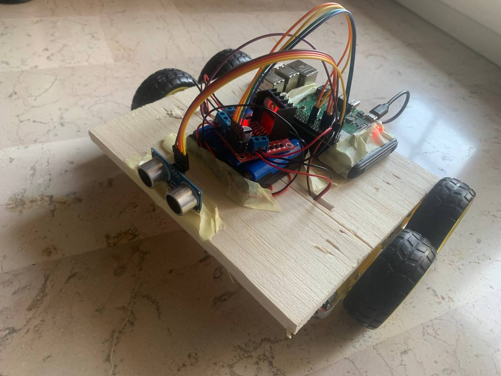
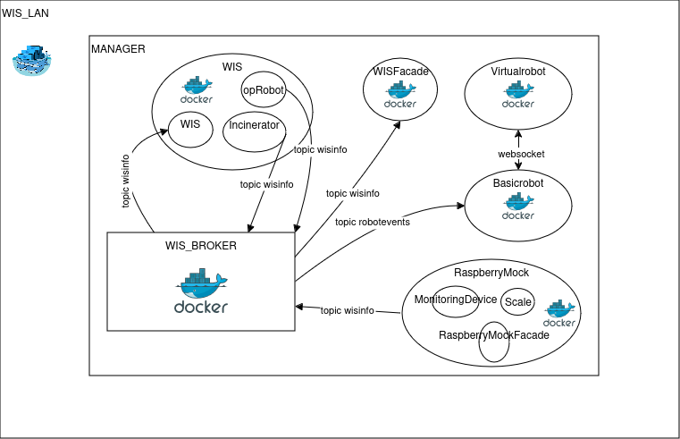
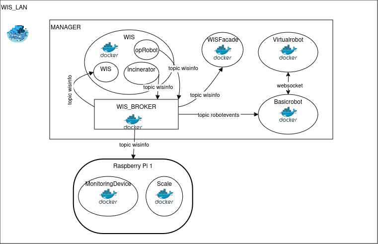
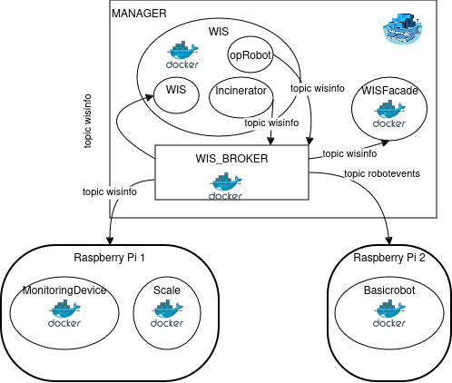

# Waste Incinerator Service
Project work for the final examination of Software Systems Engineering M at the University of Bologna.
The project has been developed using the SCRUM agile method.

## Intro
The subject is a Waste Incinerator Service: A robot is placed in it, it takes waste packets, puts them
into an incinerator, waits until the burn is finished, and then places the ashes in an ash storage.
Here is an illustration:

## Demo
Watch a demo of the final system in action:

## QAK
The main language used for this project is QAK (Quasi Actor Kotlin), a Domain Specific Language that has
allowed us to think in terms of actors and messages, thereby avoiding many low-level details.
Moreover, it has enabled us to produce prototypes that can be executed immediately, making it a very
effective choice considering the method we have adopted.
You can find some useful documentation on this language  [here](sprint0/userDocs/qak_documentation.pdf).

## Roadmap
1. **Sprint 0**: Requirements analysis. UserDocs: [sprint0.qak](sprint0/userDocs/docSprint0.html).
2. **Sprint 1**: Initial Waste Incinerator Service implementation. Latest Release: [sprint1.qak](sprint1/userDocs/docSprint1.html).
3. **Sprint 2**: Added Scale and MonitoringDevice. Latest Release: [sprint2](sprint2/userDocs/docSprint2.html).
4. **Sprint 3**: Introduced WISFacade and RaspberryMock. Latest Release: [sprint3](sprint3/userDocs/docSprint3.html).
5. **Sprint 4**: Integration with Physical Robot. Latest Release: [sprint4](sprint4/userDocs/docSprint4.html).

## Application Overview  
The entire system is containerized using Docker, allowing distributed execution without requiring additional installations beyond Docker itself.  

### Key Features:   
- **Docker Swarm**: Used for orchestration during development due to its simplicity, high availability mechanisms, self-healing features. These capabilities ensured minimal downtime and automatic recovery of services, aligning perfectly with the distributed nature of our application. Moreover, its lightweight nature has made it an interesting choice for deployment on a Raspberry Pi 3. 
- **Future Migration Plan**: Aiming to transition to a lightweight Kubernetes distribution to improve customization, scalability, and security.  
- **Configuration via JSON files**: Enables adherence to the Dependency Injection (DI) principle. 

### Application Components  
1. **WIS**  
   The core system logic, implemented as several **actors**:  
   - **WIS**: Acts as the system’s "brain," controlling the robot based on the state of the **Monitoring Device** and **Scale**.  
   - **opRobot**: Represents the robot. Changes state according to commands from WIS and operates the physical robot.  
   - **Incinerator**: Simulates an incineration process.  

2. **WISFacade**  
   A Spring-based web application that observes and visualizes the state of all system components.  
     

3. **Monitoring Device**  
   A QAK application that uses the **lgpiod library** to interface with Raspberry Pi GPIO pins. The physical device comprises:  
   - Raspberry Pi (Model 3 used).  
   - Sonar sensor.  
   - a LED.  
     
   More details: [related documentation](sprint2/userDocs/docSprint2.html).  

4. **Scale**  
   Similar to the **Monitoring Device**, this QAK application uses the **lgpiod library** to read measurements from:  
   - HX711 load cell.  
   - Analog-to-Digital (A/D) converter.  
     
   More details: [related documentation](sprint2/userDocs/docSprint2.html).  

5. **RaspberryMock**  
   This container includes a QAK application and a Spring web application, simulating **Scale** and **Monitoring Device** for testing purposes without requiring physical Raspberry Pi hardware.  
     

6. **WISBroker**  
   Implements the MQTT protocol for inter-component communication, ensuring loose coupling between system nodes. This design increases system scalability by eliminating direct node dependencies.  

7. **Basicrobot**  
   Provided by the **client** (committente), this middleware connects the application logic to the robot hardware (physical or virtual).  
   - **Physical Robot**: Custom-built using:  
     - Chassis made of raft material.  
     - Raspberry Pi 3.  
     - Sonar for obstacle detection.  
     - H-Bridge motor driver.  
     - Four DC motors powered by a four-battery slot.  
       

8. **VirtualRobot**  
   Also provided by the **client**, this QAK application includes a web interface for testing in the absence of a physical robot.  
     

### Application Releases  
Three releases have been proposed:  
1. **Mock System**:  
   Cluster with all components except the Raspberry Pi-related ones, enabling PC-based testing.  
   Configuration file: [wismock.yaml](sprint4/deployment/wismock.yaml).  
     

2. **Virtual Robot Integration**:  
   Cluster with a manager node (containing WIS, WISFacade, BasicRobot, VirtualRobot) and a worker node (with Scale and Monitoring Device). Supports testing with Raspberry Pi sensors but without a physical robot.  
   Configuration file: [wis_virtualrobot.yaml](sprint4/deployment/wis_virtualrobot.yaml).  
     

3. **Final System**:  
   A distributed cluster with:  
   - Manager node: Hosts WIS and WISFacade.  
   - Worker node 1: Hosts BasicRobot and VirtualRobot.  
   - Worker node 2: Hosts Scale and Monitoring Device.  
   Configuration file: [wis.yaml](sprint4/deployment/wis.yaml).  
   