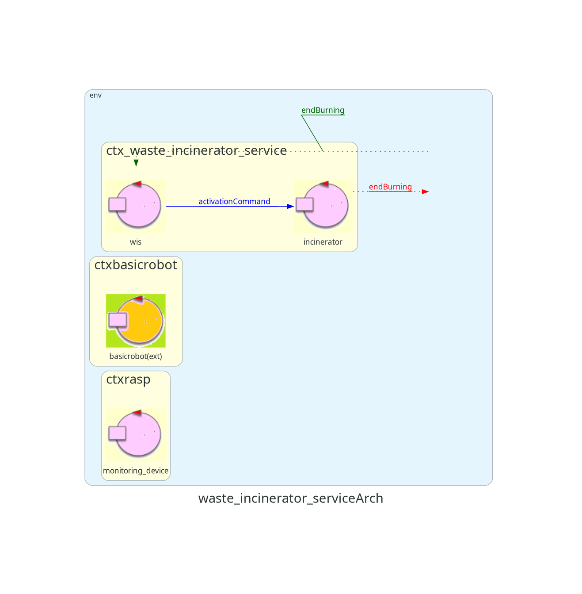

# WASTE INCINERATOR SERVICE - Sprint 0

## Introduction

A company intends to develop a **WasteIncineratorService** to treat waste by incinerating it and requires a software system service (WIS) that controls a robot (called OpRobot) to move the waste.

## Requirements

The following link leads to the requirements document provided by the client.  
[Requirements Document](./userDocs/TemaFinale24.html)

## Requirement Analysis

### Structural Part

In this first part of the requirements analysis, we model the components of the "structural" part of the building.

#### Service Area Model

The **Service Area** is a Euclidean flat space bounded by edges.  
The area is viewed as a coordinate system starting from the top-left point, labeled (0,0).  
The X-coordinate (abscissa) grows to the right, and the Y-coordinate (ordinate) grows downward.

#### Home Location

The initial state of the OpRobot is the top-left corner, called **Home** (coordinates (0,0)).

#### Incinerator

**Incinerator** has its own behavior, as it needs to be remotely activated and communicate to the OpRobot and the system when the burning phase is complete.  
For simplicity, its representation inside the Service Area is given by a rectangle, characterized by four coordinates representing its vertices.  
It has two doors (**BurnIN** and **BurnOUT**) mapped as the left and bottom sides of the Incinerator.

#### WasteIN Door

The **WasteIN** door is modeled as a segment (it has no area since it faces outside the Service Area) starting at coordinates **(0, lf)** and has a length of *tot * DR* robot units, which is unspecified in the requirements.

#### AshOUT Door

The **AshOUT** door is modeled as a segment (it has no area since it faces outside the Service Area) starting at coordinates **(lu - tot*dr, lf)** and has a length of *tot * DR* robot units, which is unspecified in the requirements.

Below is an image summarizing the location of components in the Service Area: (the placement and size of the Incinerator and the size of the WasteIN and AshOUT doors are indicative)  
[Service Area Structure](./userDocs/img/struttura_Building.png)  
The division of the room into cells is a possible model since the client provides a DDR Robot, which allows defining a unit of measure for the room.  
This unit of measure is the **robotic unit (DR)**. Each cell therefore measures 1 DR.  
The size of the **Home** is unspecified in the requirements, so for simplicity, it is assumed to have an area of 1 DR (one cell).

#### WasteStorage Container

The **WasteStorage** container is external to the Service Area, so it doesn't require coordinates for mapping.  
Its maximum capacity is unspecified, so it is considered "unlimited" in this initial phase.

#### AshStorage Container

The **AshStorage** container is external to the Service Area, so it doesn't require coordinates for mapping.  
Its capacity is set to hold approximately 3 or 4 Roll Packets of ash.

#### MonitoringDevice

The **MonitoringDevice** is external to the Service Area, so it doesn't require coordinates for mapping.  
It consists of a Sonar and a Led operating on a RaspberryPi.

### Component Formalization

Now, we need to represent the components described in the previous section at the software level.  
From software engineering, we know that an entity can be modeled as a function, a POJO, or a process.  
However, analyzing the requirements and taking **Incinerator** as an example, we notice that it must be able to send and receive messages with other system entities.  
There is therefore an **abstraction gap** between the definition of Incinerator and the ways we know to represent it, as neither a function nor a POJO or process inherently involves message exchange.  
Thus, we decide to model **Incinerator** as a **Service**.  
However, we encounter another issue, as representing a service requires knowing its technology, and at this stage, we want to remain **technology-independent**.  
Fortunately, our software house provides us with a modeling language (a **meta-model**, called **QAK**) that allows us to define **Actors**.  
Now that we have this concept, we can model the previously described components:

- **Incinerator**: Actor, as it must be able to exchange information with the system and the OpRobot. It has a state (0 = not burning, 1 = burning).
- **WasteStorage container**: Decided not to model this entity as it is merely a container for RP, and has no significant behavior in the system. Instead, we model the **Scale**, as it detects the presence and weight of RP in the area. The decision to model the scale as an actor or POJO will depend on further analysis of the problem.
- **AshStorage container**: Decided not to model this entity as it is merely a container for ash, and has no significant behavior in the system.
- **MonitoringDevice**: Actor, which uses the sonar to detect the height of the ash pile in the AshStorage and the LED to communicate its state.  
In the requirement model, we treat it as a single component because we don't yet have enough data for a more detailed discussion.
  
The **WIS** is represented as an Actor responsible for controlling the OpRobot.  
Finally, we discuss the representation of the **OpRobot**.  
From the requirements document, there is no indication to model it as an actor or POJO.  
Between the two options, it seems more appropriate to consider it as a passive entity that receives orders from the WIS and executes them, as there is no indication that it communicates with other entities or has an independent execution flow.  
However, we will defer this decision to a later stage of problem analysis.

In our requirements model, we use the **BasicRobot** provided, which will not depend on the specific physical robot (DDR Robot) the client provides.

### Requirements Architecture

We now define a [model](./src/WasteIncineratorService_v1.qak) that describes how the previously listed components interact with each other.  

#### Message Types Discussion

QAK actors define three types of messages:
- **Dispatch**: A message sent to a specific recipient with no expectation of a response (fire-and-forget).
- **Request**: A message sent to a specific recipient expecting a logically related reply.
- **Event**: A message sent to anyone who can process it.

The **activationCommand** message is the command to activate the Incinerator. From the requirements, it is clear that it is a **Dispatch** message, as no response is required.  
To know if the Incinerator has been activated, we simply need to "observe" it, so any response would be irrelevant.  
The requirements do not specify which entity is responsible for issuing this command. After discussing with the client, they confirmed that it is the WIS's responsibility to do so at system startup.

The notification that the burning phase is complete is modeled as an **endBurning** message of type **Event**.  
This choice fits the requirement of emitting a signal from the Incinerator.

#### Notes on the Architecture and Components to Implement

The system is distributed across at least three different computational nodes.  
We will need to develop the following macro-components:
- **wis**
- **monitoring_device**
- **incinerator**

The **BasicRobot** component is already provided, so there is no need to implement it.

## Test Plan

In the first phase of the requirements analysis, a **functional test plan** is prepared.  
It is planned to verify the system's correct behavior by simply observing it at the terminals.  
Specifically, we need to verify that with incoming packets, after a time > **BURNTIME**, there is ash in the output.  
More specifically, if there is an arbitrary number of packets in the WasteStorage, the ash in the AshStorage (provided it is not emptied in the meantime) should correspond to the number of packets.  
Since we have not yet been able to create a complete and fully functional model (due to a lack of information in the requirements document), it is not yet possible to experimentally verify the above.  
Therefore, the actual testing phase will be deferred to later stages of the project.

## Future Sprints

In the next sprint, a first functional prototype covering the main system logic is expected.  
In particular, the incinerator and the interaction between the robot and the WIS are expected to be modeled.

---

### Contact Information

Bryan Bertoni: bryan.bertoni@studio.unibo.it  
Gabriele Daga: gabriele.daga@studio.unibo.it  
Emanuele D'Arsié: emanuele.darsie@studio.unibo.it  

