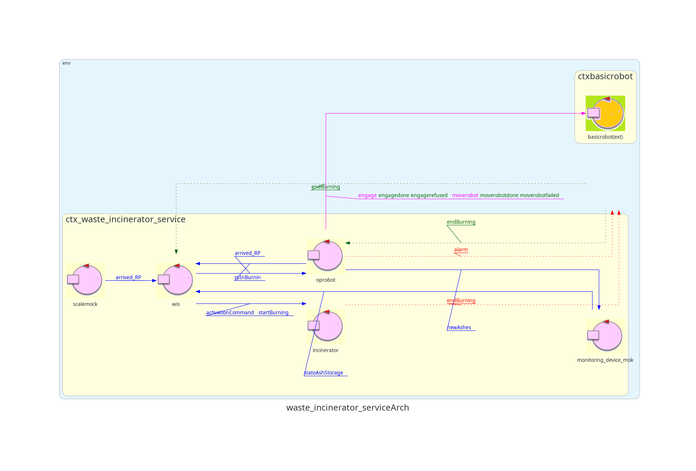
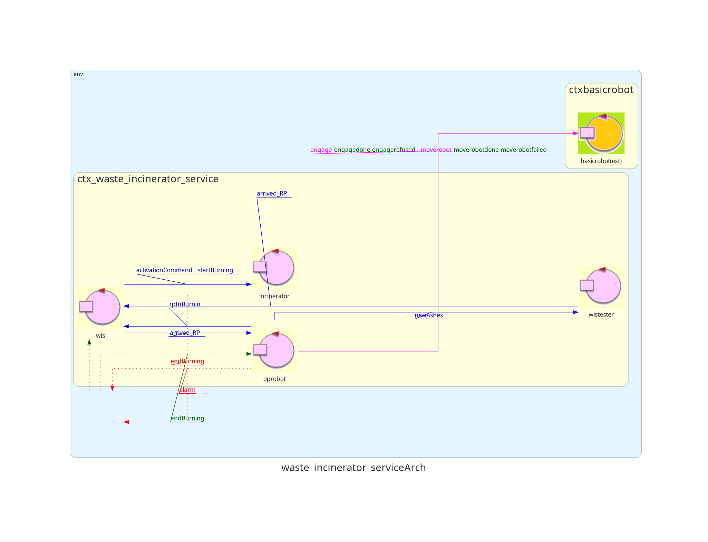

# Waste Incinerator Service - Sprint 1

---

## Table of Contents
1. [Introduction](#introduction)
2. [Requirements](#requirements)
3. [Previous Sprint](#previous-sprint)
4. [Goals](#goals)
5. [Problem Analysis](#problem-analysis)
6. [Project Architecture](#project-architecture)
7. [Testing Plan](#testing-plan)
8. [Deployment](#deployment)
9. [Future Work](#future-work)
10. [Authors](#authors)

---

## Introduction
The **Waste Incinerator Service (WIS)** facilitates the incineration of waste using a robot called **OpRobot**. This sprint focuses on implementing the interactions between:
- **WIS and OpRobot**
- **WIS/OpRobot and the Incinerator**

---

## Requirements
- [Requirements document](./userDocs/TemaFinale24.html)

---

## Previous Sprint
- [Sprint 0 Document](../sprint0/README.md)
  
The initial architecture from Sprint 0 serves as the baseline for this sprint:


---

## Goals
This sprint addresses the following interactions:
- **WIS - OpRobot** interaction
- **WIS/OpRobot - Incinerator** interaction

Future sprints will handle:
- Interaction with the Sonar of the MonitoringDevice
- Interaction with the Scale of the WasteStorage

---

## Problem Analysis

### WIS - OpRobot Interaction
- **P1:** How to model OpRobot: as an independent actor or as a POJO within WIS?  
  *Solution:* Model OpRobot as an actor to handle BasicRobot commands efficiently.

- **P2:** Should OpRobot know the room's state or rely on WIS commands?  
  *Solution:* WIS should manage room state, while OpRobot focuses on movement commands.

### WIS/OpRobot - Incinerator Interaction
- **P3:** How to initiate Incinerator burning after RP deposition?  
  *Solution:* Introduce a `startBurning` message for the Incinerator.

- **P4:** How to map the room for OpRobot's movement?  
  *Solution:* Use tools like [MapBuilder](./userDocs/MapBuilder24.html) and [Planner](./userDocs/Planner.html) for room mapping and path planning.

---

## Project Architecture
Logical problem architecture:  
  
The architecture uses mock actors for initial testing:
- **monitoring_device_mock**: Simulates MonitoringDevice behavior.
- **scale_mock**: Simulates Scale behavior.

Proposed project architecture:  
  

---

## Testing Plan
Automated testing is performed using **JUnit**:
- Test 1: Verify ash production when RP is deposited and AshStorage is not full.
- Test 2: Verify no ash production when AshStorage is full.

[Test Implementation](./src/main/java/test/TestWISOutput.java)

---

## Deployment

### Steps to Run the Prototype
1. **VirtualRobot Simulation Environment**:
   ```bash
   docker compose -f ./virtualRobot23.yaml up
2. **BasicRobot**:
    ```gradlew run```
3. **Waste Incinerator Service**:
    ```gradlew run```
The result is a virtual robot executing waste movement logic.
For continuous testing, use the logical architecture model instead of the project model.

## Future Work

    Replace mocks with a functional MonitoringDevice.
    Integrate Sonar and LED components from Raspberry Pi.

## Authors

    Bryan Bertoni: bryan.bertoni@studio.unibo.it
    Gabriele Daga: gabriele.daga@studio.unibo.it
    Emanuele D'Arsié: emanuele.darsie@studio.unibo.it