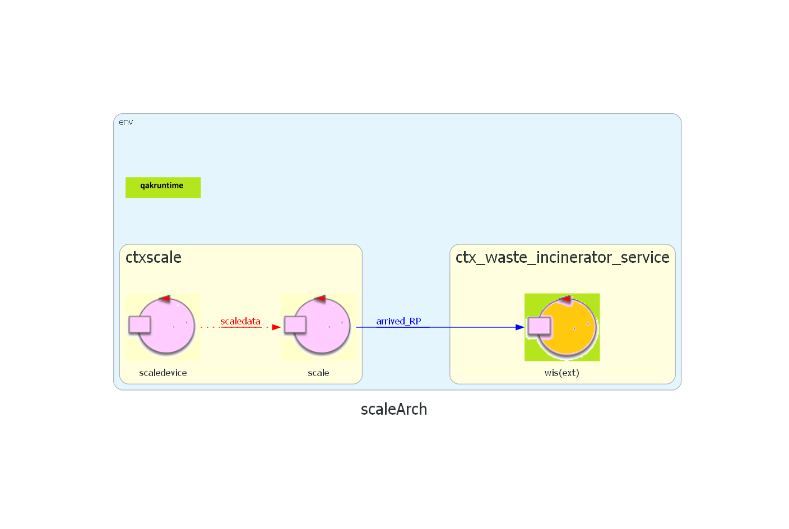
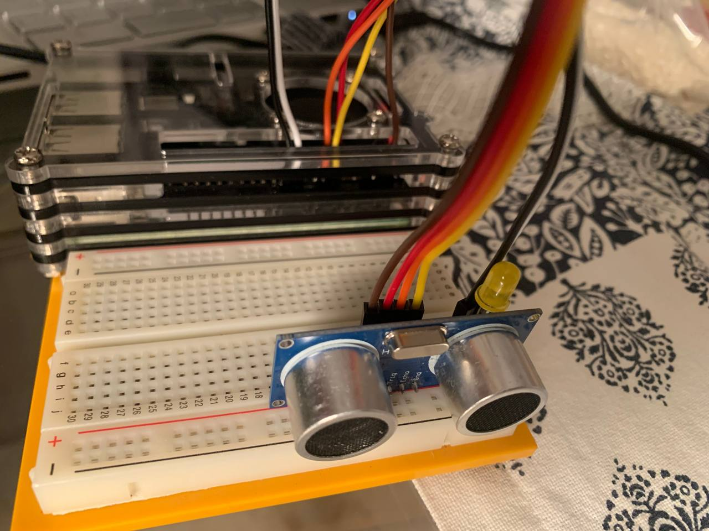
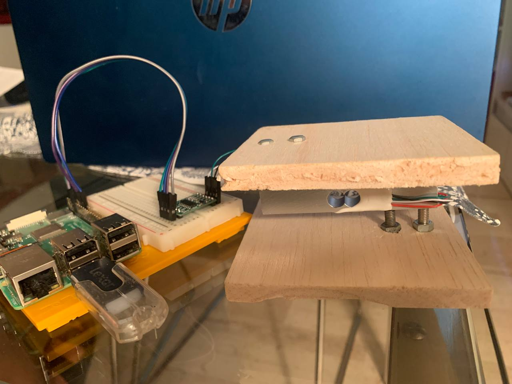

# WASTE INCINERATOR SERVICE - Sprint 2
---

## Table of Contents
1. [Introduction](#introduction)
2. [Requirements](#requirements)
3. [Previous Sprint](#previous-sprint)
4. [Goals](#goal)
5. [Problem Analysis](#problem-analysis)
6. [Project Architecture](#project)
7. [Devices Used](#devices-used)
8. [Test Plans](#test-plans)
9. [Deployment](#deployment)
10. [Future Work](#future-work)
11. [Authors](#authors)

---
## Introduction
A company intends to develop a **WasteIncineratorService** to treat waste by incineration and requires a software system service (WIS) to control a robot (called OpRobot) for moving the waste.

## Requirements
The following link leads to the requirements document provided by the client.
[Requirements Document](./userDocs/TemaFinale24.html)

## Previous Sprint
The following link leads to the document from the previous sprint, in which the requirements for the WIS-OpRobot interaction and WIS/OpRobot-Incinerator were addressed.  
[SPRINT 1](../sprint1/README.md)

### Initial Architecture Reference
The following image represents the final architecture from the previous sprint, which will serve as the initial architecture for this sprint.  


## GOAL
In this sprint, the following requirements will be addressed:
- Architecture of the MonitoringDevice
- Interaction between WIS and MonitoringDevice
- Interaction between WIS and Scale

The definition of the ServiceStatusGUI is deferred to the next sprint.

## Problem Analysis

### Architecture of the MonitoringDevice
The requirements specify that the MonitoringDevice consists of a Sonar and a Led, and operates on a RaspberryPi, an external node to the WIS system.  
The sonar is represented by the component **sonar24qak**, which includes two actors:
- **sonardevice**: Responsible for reading data from the **sonar.py** script, which continuously detects data from the physical sonar on the RaspberryPi.
- **datacleaner**: Receives the values from the sonardevice and performs additional data filtering.

The physical led will be managed by another actor called **led**, which triggers scripts for turning the led on, off, or flashing.  
The MonitoringDevice will be seen as a single component externally, which consists of the described actors internally.

### Interaction between WIS and MonitoringDevice
The main issues regarding the WIS-MonitoringDevice interaction are as follows:
- **P1**: When the MonitoringDevice detects that the ashStorage is full, how does it notify this information to the WIS?
- **P2**: How can we know when the ashStorage is empty?
- **P3**: Is the status of the WIS components also known to the MonitoringDevice, or must it explicitly request this information?

#### Problem P1: MonitoringDevice Full AshStorage
As per the requirements, when the ashStorage is full, the WIS must prevent further burning of RP until the external operator empties it.  
The best approach, consistent with Sprint 1, is to make the WIS an **Observer** of the MonitoringDevice, specifically monitoring the ashStorage state.  
When the **datacleaner** detects a distance equal to or smaller than a certain limit (DLIMT), the ashStorage is considered full, and the state is updated.

#### Problem P2: MonitoringDevice Empty AshStorage
Determining when the ashStorage is empty is more complex, as there is no specific parameter in the requirements for this.  
A potential solution is to consider it empty when the system starts or after the operator empties it. Another approach is to introduce a parameter (e.g., set through a GUI) indicating the distance between the sonar and the bottom of the container. When this distance is detected, the ashStorage can be considered empty.

#### Problem P3: WIS Component Status Visibility
The only component of the WIS that the MonitoringDevice is interested in is the Incinerator. The best way to get the status of the Incinerator is for the MonitoringDevice to become an **Observer** of the Incinerator, thus avoiding unnecessary message exchanges between the WIS and the MonitoringDevice.

### Interaction between WIS and Scale
The issues related to the WIS-Scale interaction are as follows:
- **P4**: How to calculate the number of RP based on the weight detected by the physical scale?
- **P5**: How to communicate this information to the WIS?

#### Problem P4: Scale Weight to RP Conversion
The main difficulty is converting the weight measured by the scale into the number of RPs.  
The requirement specifies that an RP weighs approximately **WRP = 50 kg**. The physical measurement error, combined with this approximation, could lead to discrepancies.  
For simplicity in this phase, we choose to round down the number of RPs to calculate the number of waste packages:  
**RPs = W / WRP**, where W is the weight detected by the scale.

#### Problem P5: Communicating the Number of RPs to WIS
Once the number of RPs is calculated, it must be communicated to the WIS.  
A possible approach, similar to the MonitoringDevice, is to make the scale observable by the WIS. However, a simpler method is adopted:
1. The **scale actor**, after converting weight to the number of RPs, calculates the difference from the previous number of RPs.
2. The **scale actor** sends a **dispatch** message `arrived_rp` for each new RP to the WIS.
3. The **WIS actor** consumes the `arrived_rp` messages from its queue to know the number of RPs.

This approach avoids modifying the WIS architecture and uses the actor message queue management.

### Logical Architecture of the Problem
We define a model composed of three distinct `.qak` files that describe how the components interact:
- [WIS](./analisi_problema/wis/src/WasteIncineratorService_problema.qak)  
  
- [MonitoringDevice](./analisi_problema/monitoringDevice/src/monitoringdevice.qak)  
  
- [Scale](./analisi_problema/scale/src/scale.qak)  
  

The MonitoringDevice delegates tasks to the **sonardevice**, **datacleaner**, and **led** actors, presenting a unified component to the external environment. The **datacleaner** updates the **statoAshStorage** of the MonitoringDevice based on the cleaned data, which is used by the WIS.

Similarly, the Scale uses the **scaledevice** actor to collect measurements, converts them, and communicates them to the WIS.

## Project
In the problem analysis section, we decided to model the interaction between the MonitoringDevice and WIS and between the Scale and WIS using an **observeResource** mechanism, which fits the requirements.  
In this phase, however, a **publish/subscribe** communication model was chosen. Each time a device in one context needs to communicate with a device in another context, it emits an event to an MQTT broker, which forwards it to the appropriate context. This decouples the contexts, allowing them to function independently.

### Proxy Actors for Event Communication
To ensure no events are lost, the following proxy actors are used to receive events and retransmit them as dispatches:
- **WIS**: Receives updates from both the MonitoringDevice and Scale via the following actors:
  - **wismonitoringdeviceproxy**: Receives **statoAshStorage** events and dispatches **ashesLevel**.
  - **wisscaleproxy**: Receives **new_RP** events and dispatches **arrived_RP**.
- **MonitoringDevice**: Receives updates from the Incinerator via the **monitoringdeviceproxy** actor, which sends **incineratorState** dispatches to the MonitoringDevice.

## Devices Used
The external devices (MonitoringDevice and Scale) are designed to run on Raspberry Pi. Here’s how they are set up:

### MonitoringDevice Setup

The MonitoringDevice consists of an LED and an HC-SR04 sonar. The components are connected to the Raspberry Pi as follows:
- **LED**: Connect the anode (+) to GPIO pin BCM25 (physical pin 22) and the cathode (-) to GND (physical pin 20).
- **Sonar**: Connect the pins as follows:
  - **VCC** to pin 4
  - **GND** to pin 6
  - **TRIG** to pin 11
  - **ECHO** to pin 13

### Scale Setup

The Scale consists of a load cell and an HX711 AC/DC converter. Connect the devices as follows:
- **HX711 to Raspberry Pi**:
  - **VCC** to pin 4
  - **SCK** to pin 18
  - **DT** to pin 16
  - **GND** to pin 9
- **HX711 to Scale**:
  - **E+** (red wire)
  - **E-** (black wire)
  - **A-** (green wire)
  - **A+** (white wire)

## Test Plans
Automated testing should verify that messages from each device are correctly received by the MQTT broker. For each actor involved, a test is performed to ensure that within 20 seconds of WIS startup, updates are received. If no updates are received within 10 seconds, the Scale actor will send a **new_RP** event with a payload of 0, which will be discarded by the WIS proxy.

The automated test can be found [here](./progetto/wis/src/main/java/test/Test_Scale_MonitoringDevice.java).

## Deployment

### Deployment with Gradle
To test this first prototype of the system, the following components should be executed in this order:

1. **VirtualRobot**: Navigate to the `it.unibo.virtualRobot2023` directory, open a terminal, and run the command: ```docker compose -f .\virtualRobot23.yaml up```
2. **BasicRobot**: Navigate to the `unibo.basicrobot24` directory, open a terminal, and run the command: ```gradlew run```
3. **WasteIncineratorService**: Navigate to the `sprint2` directory, open a terminal, and run the command: ```gradlew run```

Simultaneously, while starting the WIS, the related contexts for the Scale and MonitoringDevice, which are located on two different nodes, must also be launched. To do this, follow these steps:
4. Create an executable for both the **MonitoringDevice** and **Scale** by running: ```./gradlew distZip```
5. Copy the generated zip file to both Raspberry Pi devices.
6. Unzip the file and launch the executable from the **bin** subdirectory.

### Deployment with Docker
Docker deployment was chosen to achieve a containerized solution, ready for use, which further decouples the different nodes of the system and adds security aspects (such as authentication and TLS encryption of messages between the various contexts).

First, a Dockerfile was created for each entity involved. These Dockerfiles can be found in their respective directories, providing further instructions on how to build the images.

For each image connecting to the MQTT broker, **stunnel** support was added, allowing mutual authentication and traffic encryption between the entities and the broker. This ensures that the system is protected from unauthorized access to device states and prevents intrusion attempts.

Once this setup is complete, navigate to the `sprint2/progetto/wis` directory and run:
```docker-compose -f wis.yaml up```
This will launch **VirtualRobot**, **BasicRobot**, **MQTT broker**, and **WIS** at once.
To start the MonitoringDevice and Scale on the Raspberry Pi, download the MonitoringDevice and Scale images and execute: ```docker-compose -f raspberry.yaml up```
Ensure that the `raspberry.yaml` file and the `stunnel.conf` file have been transferred.

## Future Work

In the next sprint, the web application for system monitoring is expected, as well as a web application that allows scale and monitoringdevice testing
even without raspberry available

---

## Authors

Bryan Bertoni: bryan.bertoni@studio.unibo.it  
Gabriele Daga: gabriele.daga@studio.unibo.it  
Emanuele D'Arsié: emanuele.darsie@studio.unibo.it  