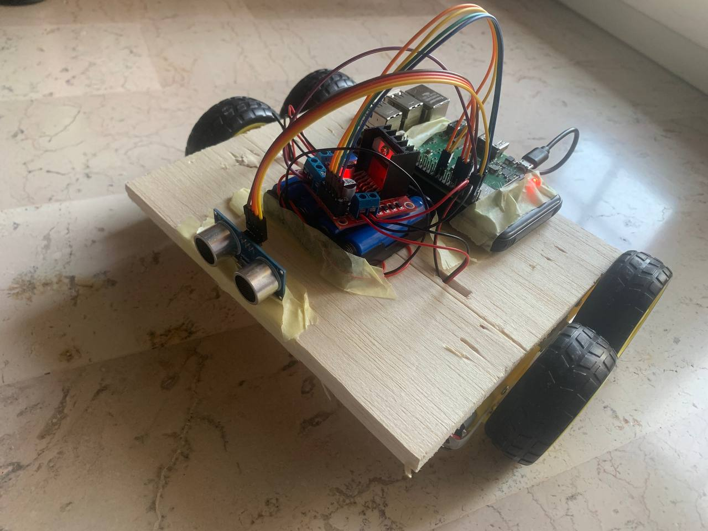
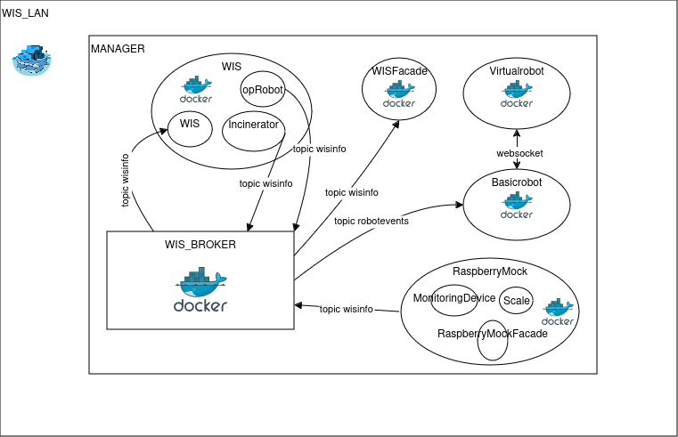
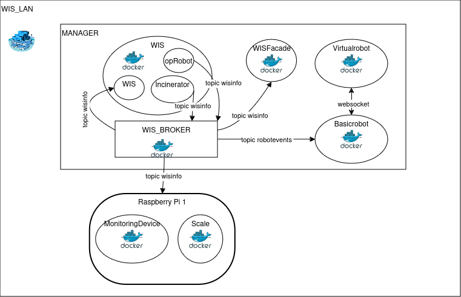
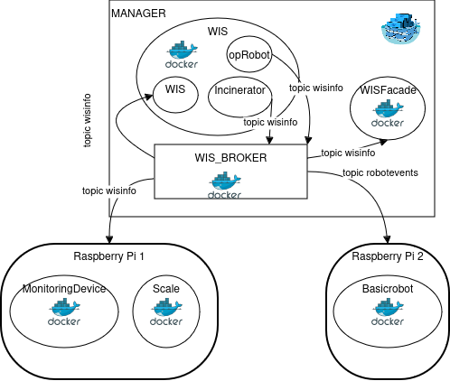

# WASTE INCINERATOR SERVICE - Sprint 4
---

## Table of Contents
1. [Introduction](#introduction)
2. [Requirements](#requirements)
3. [Previous Sprint](#previous-sprint)
4. [Goals](#goal)
5. [Problem Analysis](#problem-analysis)
6. [Project Architecture](#project)
7. [Test Plans](#test-plans)
8. [Deployment](#deployment)
9. [Future Work](#future-work)
10. [Authors](#authors)
---
## Introduction
A company plans to implement a **Waste Incinerator Service (WIS)** to process waste by burning it. The system requires a software service to control a robot (called OpRobot) that moves the waste.

## Requirements
The following link provides access to the requirements document provided by the client:  
[Requirements Document](./userDocs/TemaFinale24.html)

## Previous Sprint
The following link leads to the document for the previous sprint, during which the **ServiceStatusGUI** was developed:  
[SPRINT 3](../sprint3/README.md)

### Initial Reference Architecture
Below is an image showing the final architecture from the previous sprint, which serves as the initial architecture for this sprint:  


## GOAL
The objective of this final sprint is to transition from the virtual robot in WEnv to a physical robot (DDR).

## Problem Analysis
The main challenge is transitioning from the virtual robot to the physical robot while minimizing modifications to the initial architecture.  
**Key Consideration**: The use of a physical robot should not alter the interaction logic between the system components.  

Fortunately, the provided **[BasicRobot](./userDocs/BasicRobot24.html)** includes a [configuration file](./progetto/wis/basicrobotConfig.json) that makes it easy to switch between different robot types.  
Since the initial sprints, the OpRobot was designed to utilize the BasicRobot without being its specialization (OpRobot is not a BasicRobot).  
This design allows OpRobot to interact with the BasicRobot without concern for the underlying robot type (virtual, DDR, nano, etc.), enabling a seamless transition to the physical prototype.

## Project


No significant software modifications were needed during this sprint, aside from minor changes to the configuration file. The focus was on assembling the physical components of the robot.

### Pin Mapping with the H-Bridge:
- `in1` -> physical pin 21
- `in2` -> physical pin 19
- `in3` -> physical pin 5
- `in4` -> physical pin 3

### Pin Mapping with the Raspberry Pi:
- `vcc` -> physical pin 2
- `trig` -> physical pin 11
- `echo` -> physical pin 13
- `gnd` -> physical pin 9

## Test Plans
The test plan for this sprint emphasizes automation. Testing includes both application-level tests and validation of distributed system images.

### Node Testing Summary:
1. **WIS:**
   - **`test_newRP_MDfull`**: Simulates the arrival of a waste request (RP) when the ash storage is full.  
     **Expected Behavior**: The robot does not move.
   - **`test_newRP_MDok`**: Simulates the arrival of an RP when the ash storage is at a normal level.  
     **Expected Behavior**: The robot collects the RP.

2. **WISFacade:**
   - **`test_facade`**: Creates an HTTP mock client to verify that the facade supports HTTP connections.
   - **`test_wisfacade_MQTTIntegration`**: Simulates a websocket mock client connected simultaneously with an MQTT client notifying the arrival of an RP.  
     **Expected Behavior**: The websocket client receives the RP notification.

3. **RaspberryMock:**
   - **`test_arrived_RP`**: Sends a `new_RP` message from a facade mock and verifies MQTT publication to a test broker.
   - **`test_updateStatoAshStorage`**: Sends a `statoAshStorage` message from a facade mock and verifies MQTT publication to a test broker.  
     **Note**: Practical reasons led to testing with RaspberryMock instead of physical scale and monitoring devices, which function identically in both physical and mock environments.

### Automated Build and Testing:
Multi-stage builds were used to create container images, incorporating automated tests during the build process.  
A workflow was implemented to automatically test and validate container images for the WIS, WISFacade, and RaspberryMock upon repository updates.

## Deployment

### Deployment with Docker
Given the limitations identified in the previous sprint with `docker-compose`, a **container orchestrator** was employed for real-time deployment across all network nodes. This also enabled encrypted container-to-container traffic and key rotation for enhanced security.

#### Key Changes:
- Transitioned GPIO interaction from `RPi.GPIO` to `lgpiod` due to Docker Swarm's constraints (no privileged mode).  
- Modified deployment to include volume mapping of devices, allowing Raspberry Pi containers to handle GPIO requests.

### Deployment Commands:
1. Initialize the manager node:
   ```docker swarm init --autolock``

2. Join worker nodes:

    ```docker swarm join --token <token> <wis_ip>:2377```

    Replace <token> with the generated token and <wis_ip> with the WIS node's IP.
    
3. On the manager node, assign device labels to Raspberry Pi nodes:

    ```docker node update --label-add device=rpi node_name```

4. Deploy the stack:

    ```docker stack deploy -c wis.yaml my_stack```

In order to stop the stack, type:
    ```docker stack rm my_stack```

View real-time container logs:
    ```for service in $(sudo docker stack services --format {{.Name}} my_stack); do
        sudo docker service logs -f $service &
    done```

### Deployment Diagrams:
1. Virtual Robot with Mock Devices:

2. Virtual Robot with Physical Devices:

3. Physical Robot with Physical Devices:


## Future work
We expect to choose a different container orchestrator, in order to have a more flexible and customizable solution, that also
allows us to enforce more robust security measures.

## Authors:

    Bryan Bertoni: bryan.bertoni@studio.unibo.it
    Gabriele Daga: gabriele.daga@studio.unibo.it
    Emanuele D'Arsié: emanuele.darsie@studio.unibo.it